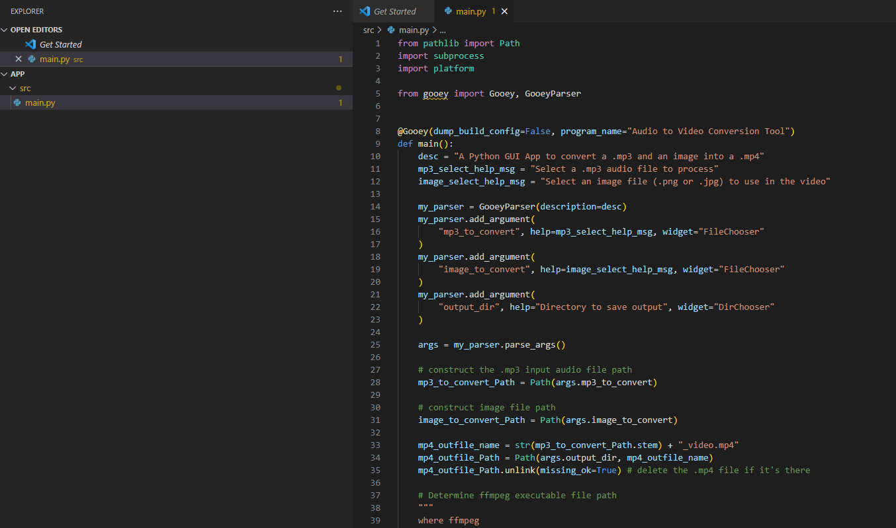
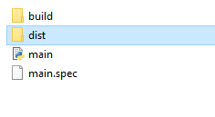
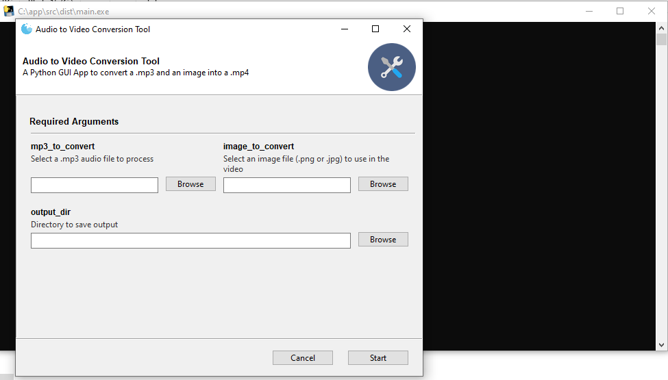
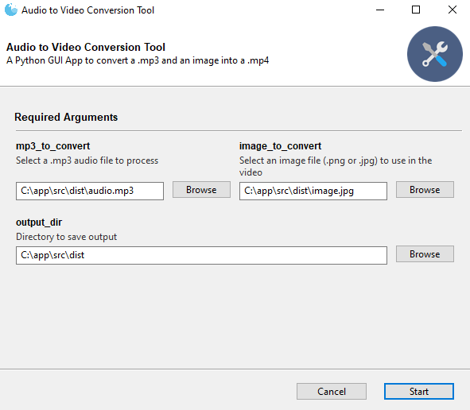
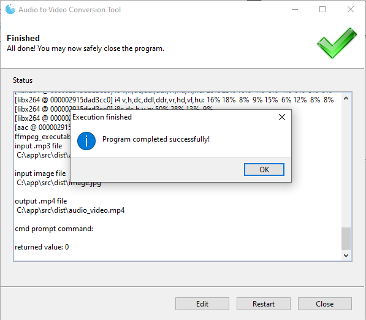
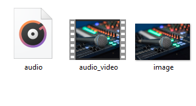
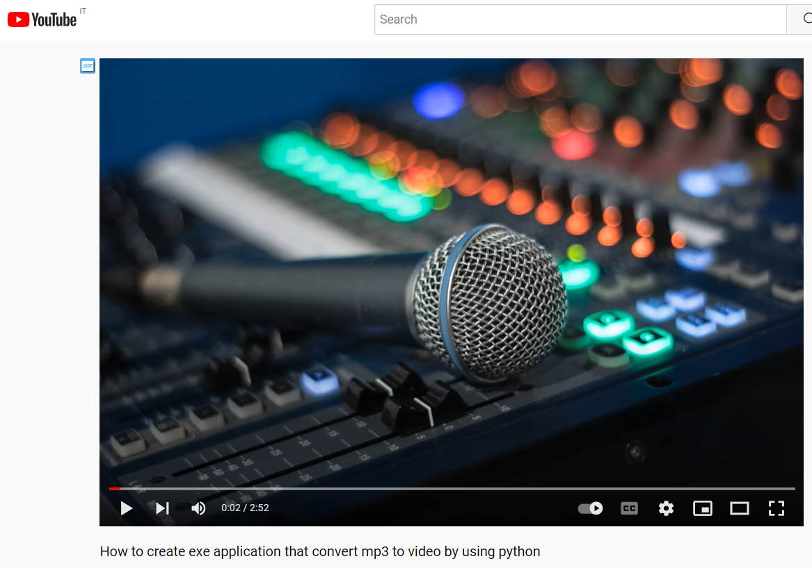

# How to create exe application that convert mp3 to video by using python 

Hello everyone, today I will explain  you how to create an executable Windows application with python.

We are interested to create  program that convert a simple mp3 audio to mp3 static image, and create an executable .exe program.

We want to create an application with  GUI window that converts a .mp3 audio file and an image into a .mp4 video

### Step 1 Installation of Conda

First you need to install anaconda at this [link](https://www.anaconda.com/products/individual)


in this location **C:\Anaconda3** , then you, check that your terminal , recognize **conda**

```
C:\conda --version
conda 4.12.0
```

## Step 2 Environment creation

The environments supported that I will consider is Python 3.10.5,

I will create an environment called **mp3-to-video **, but you can put the name that you like.

```
conda create  -y -n mp3-to-video python==3.10.5
```

and then type

```
conda activate mp3-to-video
```

You will have something like this:

```
Microsoft Windows [Version 10.0.19044.1706]
(c) Microsoft Corporation. All rights reserved.
C:\Users\ruslanmv>conda activate keras
(mp3-to-video) C:\Users\ruslanmv>
```

then in your terminal type the following commands:

```
conda install -y -c conda-forge ffmpeg gooey
```

```
pip install pyinstaller
```

### Step 3  Creation of the code.

FFmpeg is a free and open-source software project consisting of a suite of libraries and programs for handling video, audio, and other multimedia files and streams. At its core is the command-line ffmpeg tool itself, designed for processing of video and audio files

We are going to use ffmpeg application con to convert an mp3 into a mp4 with a simple image.jpg

If we want to convert a single image.jpg with an audio.mp3 into a output.mp4 we can use the following command

```
ffmpeg -i image.jpg -i audio.mp3 output.mp4
```

However for this project we want to customize a little the parameters

```
ffmpeg -loop 1 -framerate 1 -i image.jpg -i audio.mp3 -map 0:v -map 1:a -r 10 -vf "scale='iw-mod(iw,2)':'ih-mod(ih,2)',format=yuv420p" -movflags +faststart -shortest -fflags +shortest -max_interleave_delta 100M output.mp4
```

Where

- `-loop 1` makes `input.png` loop indefinitely.

- `-framerate 1` sets `input.png` input frame rate to 1 fps.

- `-map 0 -map 1:a` chooses the video from `image.png` and only the audio from `audio.mp3`. 

  This is needed in case `image.png` is smaller than any album/cover art attached to the MP3. 

- `-r 10` sets output frame rate to 10 fps. Setting input to 1 fps and output to 10 fps is for two reasons:

  - It is faster to input as 1 fps and duplicate frames to 10 fps compared to initially setting the input as 10 fps. It makes encoding faster.
  - Most players can't play anything under ~6 fps or so. 10 is a safe value.

- `scale='iw-mod(iw,2)':'ih-mod(ih,2)'` uses [scale filter](https://ffmpeg.org/ffmpeg-filters.html#scale) to make sure the output width and height are both divisible by 2 which is a requirement for some encoders. This allows you to use any arbitrarily sized image as an input. Otherwise you can get error: `width not divisible by 2`.

- `format=yuv420p` [format filter](https://ffmpeg.org/ffmpeg-filters.html#format) makes output use YUV 4:2:0 chroma subsampling for playback compatibility.

- `-movflags +faststart` makes the video start playing faster.

- `-shortest` makes the output as long as `audio.mp3`. This is needed because `-loop 1` was used.

- `-fflags +shortest -max_interleave_delta 100M` related to `-shortest` and needed in some cases due to weird behavior by ffmpeg.

So in ordering to create this program we go to our terminal and we create a a folder

```
cd \
mkdir app
cd app
mkdir src
cd src
```

we are in the src folder, there we create the following **main.py**

```python
from pathlib import Path
import subprocess
import platform

from gooey import Gooey, GooeyParser


@Gooey(dump_build_config=False, program_name="Audio to Video Conversion Tool")
def main():
    desc = "A Python GUI App to convert a .mp3 and an image into a .mp4"
    mp3_select_help_msg = "Select a .mp3 audio file to process"
    image_select_help_msg = "Select an image file (.png or .jpg) to use in the video"

    my_parser = GooeyParser(description=desc)
    my_parser.add_argument(
        "mp3_to_convert", help=mp3_select_help_msg, widget="FileChooser"
    )
    my_parser.add_argument(
        "image_to_convert", help=image_select_help_msg, widget="FileChooser"
    )
    my_parser.add_argument(
        "output_dir", help="Directory to save output", widget="DirChooser"
    )

    args = my_parser.parse_args()

    # construct the .mp3 input audio file path
    mp3_to_convert_Path = Path(args.mp3_to_convert)

    # construct image file path
    image_to_convert_Path = Path(args.image_to_convert)

    mp4_outfile_name = str(mp3_to_convert_Path.stem) + "_video.mp4"
    mp4_outfile_Path = Path(args.output_dir, mp4_outfile_name)
    mp4_outfile_Path.unlink(missing_ok=True) # delete the .mp4 file if it's there

    # Determine ffmpeg executable file path
    """
    where ffmpeg
    """
    if platform.system() == 'Windows':

        ffmpeg_path_bytes = subprocess.check_output("where ffmpeg", shell=True) 
        
    elif platform.system() == 'Linux':
        ffmpeg_path_bytes = subprocess.check_output("which ffmpeg", shell=True) 

    ffmpeg_executable_path = ffmpeg_path_bytes.decode().strip()
    print("ffmpeg_executable_path: ", ffmpeg_executable_path)

    # create the ffmpeg command
    """
    ffmpeg -i image.jpg -i audio.mp3 out.mp3 (basic)
    """
    aux = '''-map 0:v -map 1:a -r 10 -vf "scale='iw-mod(iw,2)':'ih-mod(ih,2)',format=yuv420p" -movflags +faststart -shortest -fflags +shortest -max_interleave_delta 100M '''
    ffmpeg_command = f"-loop 1 -framerate 1 -i {image_to_convert_Path} -i {mp3_to_convert_Path}  {aux}  {mp4_outfile_Path}"
    cmd_command = f"{ffmpeg_executable_path} {ffmpeg_command}"


    print(f"input .mp3 file \n {mp3_to_convert_Path}")
    print()
    print(f"input image file \n {image_to_convert_Path}")
    print()
    print(f"output .mp4 file \n {mp4_outfile_Path}")
    print()
    print("cmd prompt command: ")
    print()
  

    # call ffmpeg
    returned_value = subprocess.call(cmd_command, shell=True)# returns the exit code in unix
    
    print("returned value:", returned_value)

if __name__ == "__main__":
      main()

```

you will have something like 



## Step 4  Creation of the executable program

Here we go to our terminal

```
conda activate mp3-to-video
cd  c:\app\src
```

you will have something like

```
Microsoft Windows [Version 10.0.19044.1826]
(c) Microsoft Corporation. All rights reserved.

C:\Users\ruslanmv>conda activate mp3-to-video

(mp3-to-video) C:\Users\ruslanmv>cd c:\app\src

(mp3-to-video) c:\app\src>
```

then you  type the "magic "command 

```
pyinstaller --onefile main.py
```

and you wait like 2 minutes and you got the following output

```
(mp3-to-video) c:\app\src>pyinstaller --onefile main.py
1344 INFO: PyInstaller: 5.2
1344 INFO: Python: 3.10.5 (conda)
1358 INFO: Platform: Windows-10-10.0.19044-SP0
1359 INFO: wrote c:\app\src\main.spec
1365 INFO: UPX is not available.
1372 INFO: Extending PYTHONPATH with paths
['c:\\app\\src']
5165 INFO: checking Analysis
5166 INFO: Building Analysis because Analysis-00.toc is non existent
5166 INFO: Initializing module dependency graph...
5167 INFO: Caching module graph hooks...
.
.
.
73635 INFO: Writing RT_ICON 5 resource with 9640 bytes
73635 INFO: Writing RT_ICON 6 resource with 4264 bytes
73636 INFO: Writing RT_ICON 7 resource with 1128 bytes
73640 INFO: Copying 0 resources to EXE
73640 INFO: Embedding manifest in EXE
73641 INFO: Updating manifest in c:\app\src\dist\main.exe.notanexecutable
73702 INFO: Updating resource type 24 name 1 language 0
73705 INFO: Appending PKG archive to EXE
73724 INFO: Fixing EXE headers
77386 INFO: Building EXE from EXE-00.toc completed successfully.

(mp3-to-video) c:\app\src>

```

then inside of the folder dist



you have created you .exe file


you click twice to  main.exe



You can choose the mp3 file and the image to convert and also you choose the folder where you want that your video file will be created

and click start.



And wuala, you have created an Windows .exe application by using Python.






this is the result:





**Congratulations!** you have created an application that convert mp3 to mp4 with static image.